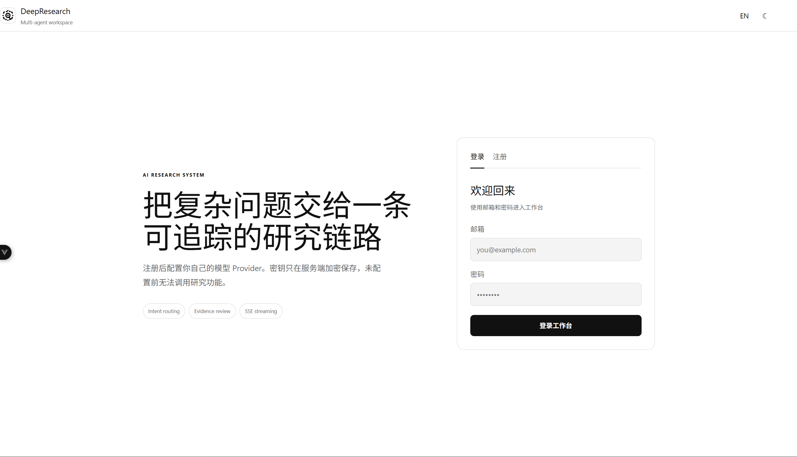
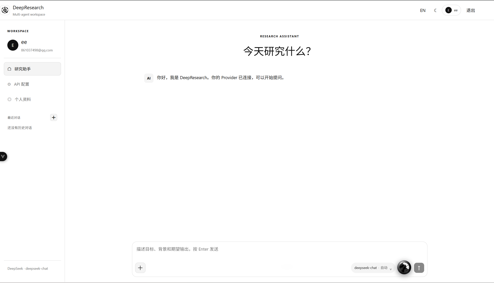
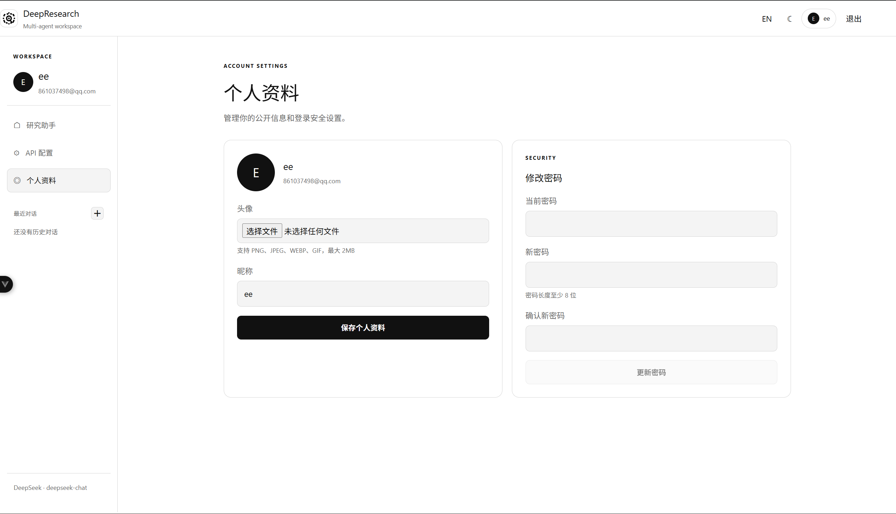

# Deep Research

Deep Research 是一个面向资料分析与深度检索的多智能体 AI 工作台。用户注册后，可以在网页中配置自己的模型 Provider，选择模型和推理等级，直接进行研究型问答，也可以上传文档或图片作为本轮研究输入。

## 功能概览

- 多智能体研究链路：意图识别、任务规划、网络检索、本地资料检索、证据判断、分析与报告生成。
- Provider 管理：支持 OpenAI Chat Completions 兼容接口、Anthropic Messages、Gemini Generate Content，并支持自定义兼容端点。
- 模型管理：测试接口、自动获取模型列表、手动指定模型、切换自动、低、中、高和极高推理等级。
- 多模态输入：支持 PNG、JPG、JPEG、WEBP、GIF、TXT、Markdown、CSV、JSON、代码文件、PDF、DOCX 和 XLSX。
- 对话工作区：最近对话、历史上下文、删除对话、主题切换和中英文界面。
- 语音交互：浏览器语音识别与播放；可选接入 Fish Audio 或 ElevenLabs，密钥只在后端使用。
- 账号与安全：注册、登录、头像、昵称、修改密码，以及按用户隔离的 Provider 和对话数据。

## 界面展示

### 登录与注册



### 研究助手工作区



### 个人资料与安全设置



## 技术栈

后端使用 Python、FastAPI、Uvicorn、SQLite、Pydantic Settings、LangChain 和 LangGraph；研究链路按节点编排多智能体流程。前端使用 Vue 3、TypeScript 和 Vite。文件解析使用 pypdf、python-docx 和 openpyxl。系统默认使用 SQLite 和内存 Checkpointer，也预留 Redis、PostgreSQL、Milvus 等扩展配置。

## 快速启动

### 环境要求

- Python 3.10 及以上，推荐 Python 3.11。
- Node.js 20.19 及以上，或 Node.js 22.12 及以上。
- npm。
- 可访问的模型接口。也可以先启动系统，再在网页的 Provider 设置中填写接口。

### 一、安装后端

在项目根目录执行：

```powershell
# Windows PowerShell
py -3.11 -m venv .venv
.\.venv\Scripts\Activate.ps1
python -m pip install --upgrade pip
pip install -r requirements.txt
Copy-Item .env.example .env
```

Linux 或 macOS：

```bash
python3 -m venv .venv
source .venv/bin/activate
python -m pip install --upgrade pip
pip install -r requirements.txt
cp .env.example .env
```

编辑 .env。网页模式下，LLM_API_KEY 可以暂时留空，登录后在 Provider 设置页配置并启用自己的接口。使用根目录的 CLI 入口 main.py 时，才需要填写全局 LLM_API_KEY。

最小网页配置示例：

```env
APP_ENV=development
HOST=0.0.0.0
PORT=8000
CORS_ALLOW_ORIGINS=http://localhost:5173,http://127.0.0.1:5173
ENABLE_MEMORY=false
CHECKPOINTER_BACKEND=memory
TTS_PROVIDER=browser
```

### 二、启动后端

保持当前目录为项目根目录：

```powershell
# Windows
.\.venv\Scripts\python.exe app/app_main.py
```

```bash
# Linux 或 macOS
.venv/bin/python app/app_main.py
```

健康检查地址为 http://127.0.0.1:8000/health。首次启动会自动创建 data/app.db 和所需数据表。

### 三、安装并启动前端

打开新的终端：

```bash
cd front/agent_front
npm install
npm run dev -- --host 0.0.0.0
```

浏览器访问 http://127.0.0.1:5173。Vite 已将 /api 和 /health 代理到 http://127.0.0.1:8000。如果前后端不在同一台机器，请修改 front/agent_front/vite.config.ts 中的 proxy.target，并同步修改后端 CORS_ALLOW_ORIGINS。

### 四、首次使用

打开网页后注册账号并登录，在 API 配置页选择协议预设，填写 Endpoint、API Key 和模型，点击测试连接、获取模型并保存启用。进入聊天页后，可以在对话框中切换模型和推理等级，上传资料，或开启语音球。

## 生产部署

生产环境必须配置独立的随机密钥，不要使用示例值：

```env
APP_ENV=production
SECRET_KEY=请替换为随机长字符串
API_KEY_ENCRYPTION_KEY=请替换为Fernet密钥
```

生成 Fernet 密钥：

```bash
python -c "from cryptography.fernet import Fernet; print(Fernet.generate_key().decode())"
```

生产环境建议使用 Uvicorn 或 Gunicorn 托管后端，并用 Nginx 统一提供 HTTPS、静态前端和 /api 反向代理。只开放 80 或 443 端口，不要把 SQLite、data/uploads 或 .env 暴露给 Web 服务器。部署完成后，将实际前端域名写入 CORS_ALLOW_ORIGINS，例如 https://research.example.com。

前端生产构建：

```bash
cd front/agent_front
npm run build
```

构建结果位于 front/agent_front/dist。Nginx 应将 /api 和 /health 转发到后端，将其他路径回退到 dist/index.html。

## 配置说明

| 配置 | 作用 |
| --- | --- |
| LLM_PROVIDER、LLM_BASE_URL、MODEL | CLI 或全局默认模型配置 |
| LLM_API_KEY | CLI 使用的全局模型密钥，网页 Provider 可独立配置 |
| SECRET_KEY | 登录令牌签名密钥 |
| API_KEY_ENCRYPTION_KEY | Provider API Key 的 Fernet 加密密钥 |
| AUTH_DB_PATH | SQLite 数据库路径，默认 ./data/app.db |
| CORS_ALLOW_ORIGINS | 允许访问后端的前端来源，多个地址用逗号分隔 |
| TTS_PROVIDER | browser、fish 或 elevenlabs |
| TTS_API_KEY、TTS_VOICE_ID | 云端语音服务配置，密钥只在后端读取 |
| ENABLE_MEMORY、CHECKPOINTER_BACKEND | 可选记忆和 LangGraph 持久化配置 |

修改 API_KEY_ENCRYPTION_KEY 会导致旧 Provider 密钥无法解密，必须先导出必要配置或重新配置 Provider。

## 数据与隐私

项目已通过 .gitignore 排除 .env、数据库、WAL 文件、上传目录、日志、虚拟环境、node_modules 和前端构建产物。Provider 密钥在服务端加密保存，前端列表不会回显原始密钥。附件仅用于当前研究请求，完成或失败后会自动清理。发布仓库前仍应检查 git status，并确认没有手动强制添加上述文件。

## 常见问题

1. 页面打不开：确认后端 8000 和前端 5173 均已启动，检查浏览器访问的地址和防火墙规则。
2. 跨域错误：将前端真实来源加入 CORS_ALLOW_ORIGINS，并重启后端。
3. 获取不到模型：Endpoint 填写服务商的根地址或 /v1 地址，不要填写完整的 /chat/completions；Anthropic 协议通常需要手动填写模型 ID。
4. 研究请求提示没有 Provider：登录后进入 API 配置，保存并启用至少一个 Provider。
5. Fish Audio 返回 402：通常是账户余额或 credit 不足，需要在服务商侧充值或更换可用音色服务。
6. 上传失败：检查扩展名、文件大小和后端依赖；单次最多上传 5 个文件，单文件最大 10 MB。

## 联系方式

微信：Sane_926
